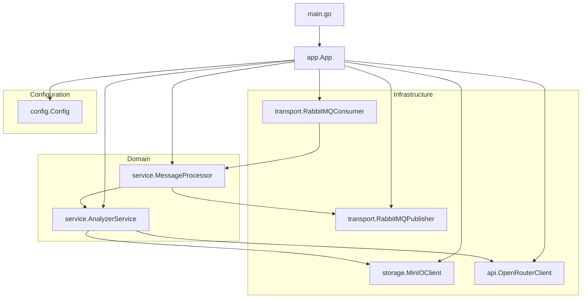
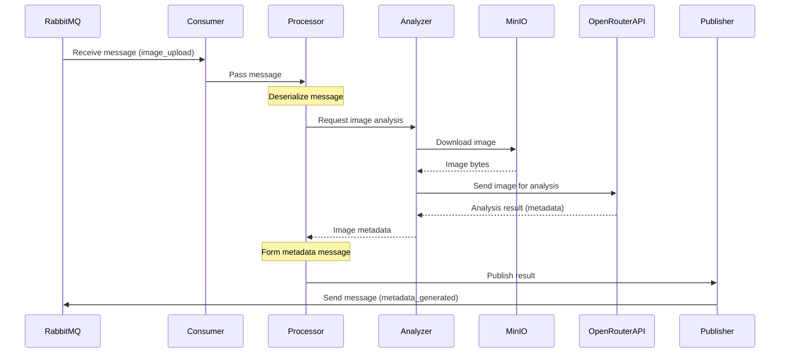

# Analyzer Service Architecture

This document describes the architecture for the Analyzer Service in the Photo Tags Service project.

## Service Overview

The Analyzer Service is responsible for:

-   Consuming tasks from RabbitMQ queue (`image_upload`)
-   Downloading images from MinIO storage
-   Interacting with OpenRouter API (GPT-4o) for image analysis
-   Generating metadata (title, description, keywords)
-   Publishing results to RabbitMQ queue (`metadata_generated`)

## Package Structure

```
services/analyzer/
├── cmd/
│   └── main.go                    # Application entry point
├── internal/
│   ├── config/                    # Service configuration
│   │   └── config.go              # Configuration structures and loading
│   ├── domain/                    # Domain models and business logic
│   │   ├── model/                 # Data models
│   │   │   ├── message.go         # Message structures
│   │   │   └── metadata.go        # Metadata model
│   │   └── service/               # Service layers
│   │       ├── analyzer.go        # Image analysis service
│   │       └── processor.go       # Message processor
│   ├── transport/                 # Transport layer
│   │   └── rabbitmq/              # RabbitMQ client
│   │       ├── consumer.go        # Message consumer
│   │       └── publisher.go       # Message publisher
│   ├── storage/                   # Storage layer
│   │   └── minio/                 # MinIO client
│   │       └── client.go          # Storage operations
│   ├── api/                       # External API interactions
│   │   └── openrouter/            # OpenRouter API client
│   │       └── client.go          # GPT-4o interface
│   └── app/                       # Application initialization
│       └── app.go                 # Application assembly and startup
└── go.mod                         # Application module
```

## Component Diagram



## Processing Sequence Diagram



## Key Interfaces and Structures

### Data Models

```go
// domain/model/message.go
type ImageUploadMessage struct {
    TraceID          string    `json:"trace_id"`
    GroupID          string    `json:"group_id"`
    TelegramID       int64     `json:"telegram_id"`
    TelegramUsername string    `json:"telegram_username"`
    OriginalFilename string    `json:"original_filename"`
    OriginalPath     string    `json:"original_path"`
    Timestamp        time.Time `json:"timestamp"`
}

type MetadataGeneratedMessage struct {
    TraceID          string    `json:"trace_id"`
    GroupID          string    `json:"group_id"`
    TelegramID       int64     `json:"telegram_id"`
    OriginalFilename string    `json:"original_filename"`
    OriginalPath     string    `json:"original_path"`
    Metadata         Metadata  `json:"metadata"`
    Timestamp        time.Time `json:"timestamp"`
}

// domain/model/metadata.go
type Metadata struct {
    Title       string   `json:"title"`
    Description string   `json:"description"`
    Keywords    []string `json:"keywords"`
}
```

### Configuration

```go
// config/config.go
type Config struct {
    RabbitMQ struct {
        URL               string
        ConsumerQueue     string
        PublisherQueue    string
        PrefetchCount     int
        ReconnectAttempts int
        ReconnectDelay    time.Duration
    }

    MinIO struct {
        Endpoint        string
        AccessKey       string
        SecretKey       string
        UseSSL          bool
        OriginalBucket  string
        DownloadTimeout time.Duration
    }

    OpenRouter struct {
        APIKey      string
        Model       string
        MaxTokens   int
        Temperature float64
        Prompt      string
    }

    Log struct {
        Level  string
        Format string
    }

    Worker struct {
        Concurrency int
        MaxRetries  int
        RetryDelay  time.Duration
    }
}
```

### Service Interfaces

```go
// api/openrouter/client.go
type OpenRouterClient interface {
    AnalyzeImage(ctx context.Context, imageBytes []byte, traceID string) (Metadata, error)
}

// storage/minio/client.go
type MinIOClient interface {
    DownloadImage(ctx context.Context, path string) ([]byte, error)
}

// transport/rabbitmq/consumer.go
type MessageConsumer interface {
    Consume(ctx context.Context, handler func(message []byte) error) error
    Close() error
}

// transport/rabbitmq/publisher.go
type MessagePublisher interface {
    Publish(ctx context.Context, message []byte) error
    Close() error
}

// domain/service/analyzer.go
type ImageAnalyzer interface {
    AnalyzeImage(ctx context.Context, msg ImageUploadMessage) (Metadata, error)
}

// domain/service/processor.go
type MessageProcessor interface {
    Process(ctx context.Context, message []byte) error
}
```

## Key Architecture Aspects

### 1. Modularity and Separation of Concerns

-   Clear separation into layers: transport, domain, infrastructure
-   Isolated business logic in domain/service packages
-   Interface-based design for testability and flexibility

### 2. Horizontal Scaling

-   Stateless approach
-   Configurable number of workers
-   Support for multiple service instances
-   Workers can process messages concurrently

### 3. Reliability and Error Handling

-   Retry mechanism with exponential backoff
-   Structured logging with trace information
-   Context-based lifecycle management for operations
-   Error classification (transient vs. permanent failures)

### 4. OpenRouter API Integration

-   Adapter for GPT-4o
-   Processing API responses and metadata parsing
-   Flexible prompt configuration via environment variables

### 5. Environment-based Configuration

-   Parameterization of all components
-   Easy configuration in different environments
-   Use of environment variables for secrets and settings

## Application Startup Flow

1. Load configuration from environment variables
2. Initialize infrastructure components (RabbitMQ, MinIO, OpenRouter clients)
3. Set up service components (analyzer, processor)
4. Start configurable number of worker goroutines for message consumption
5. Handle system signals for graceful shutdown
6. Release resources on shutdown

## Error Handling and Retries

The service implements a robust error handling strategy:

-   Classification of errors as transient or permanent
-   Exponential backoff for retrying transient failures
-   Structured logging of errors with trace IDs
-   Context-based cancellation for long-running operations

## OpenRouter API Integration

The service communicates with the OpenRouter API to analyze images using GPT-4o:

-   Base64 encoding of image data
-   Construction of appropriate prompts
-   Processing of API responses to extract structured metadata
-   Fallback strategies for format variations in responses
